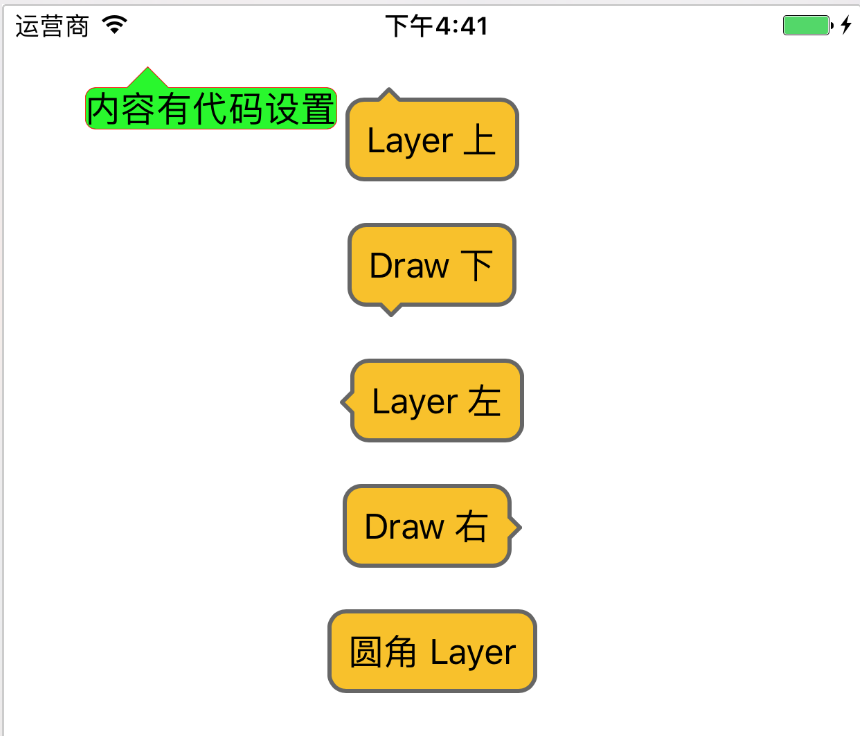
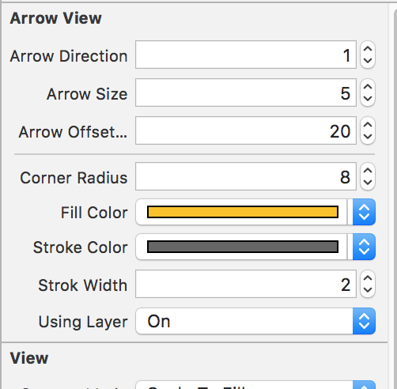

# ArrowView-iOS
--

带小三角的 View 支持方向 上,下,左,右,无
screenshot:

##使用方式:##
# 一. xib 中设置:#
 

 arrowDirection:
 三角形方向 ,由于使用 enum ib不支持 ,使用整数支持
 
     typedef enum : NSUInteger {
        ArrowDirectionNone = 0, // 0 = 无方向 圆角矩形
        ArrowDirectionUp = UIPopoverArrowDirectionUp, // 1 = 方向上
        ArrowDirectionDown = UIPopoverArrowDirectionDown,//2 = 方向下
        ArrowDirectionLeft = UIPopoverArrowDirectionLeft,//4 = 方向左
        ArrowDirectionRight = UIPopoverArrowDirectionRight,//8 = 方向右
    } ArrowDirection;

 arrowSize:
 三角形突出高度
 
 arrowOffset:
 三角形定点偏移位置 X, 或者 Y
 
 cornerRadius: 圆角矩形圆角
 
 fillColor strokeColor: 填充,描边颜色,如果为空则不会绘制!!
 
 strokeWidth: 描边宽度 , 0 则表示不描边
 
 Using Layer 使用 CAShaperLayer 绘制 .否则使用 drawRect 绘制,默认 drawRect
 
 
# 二. 代码中设置
    
    UILabel*label = [[UILabel alloc]initWithFrame:CGRectMake(0, 0, 100, 50)];
    label.text = @"内容有代码设置";
    label.layer.cornerRadius = 3.0f;
    label.layer.masksToBounds = YES;
    label.backgroundColor = [UIColor yellowColor];
    
    ArrowView *arrow = [[ArrowView alloc]initWithFrame:CGRectMake(10, 80, 120, 80)];
    arrow.usingLayer = YES;
    arrow.arrowDirection = ArrowDirectionUp;
    arrow.arrowSize = 10;
    arrow.arrowOffsetXorY = 30;
    arrow.fillColor = [UIColor greenColor];
    arrow.strokeColor = [UIColor redColor];
    arrow.strokWidth = 1.0/[UIScreen mainScreen].scale;
    [arrow setContentView:label];
    [self.view addSubview:arrow];
    
    //这个很重要.需要设置!!
    [self.view addConstraint:[NSLayoutConstraint constraintWithItem:arrow attribute:NSLayoutAttributeTop relatedBy:NSLayoutRelationEqual toItem:self.view attribute:NSLayoutAttributeTopMargin multiplier:1 constant:30]];
    
    [self.view addConstraint:[NSLayoutConstraint constraintWithItem:arrow attribute:NSLayoutAttributeLeading relatedBy:NSLayoutRelationEqual toItem:self.view attribute:NSLayoutAttributeLeadingMargin multiplier:1 constant:20]];
 
 
 
####*  注意!!!! 多个 subview 只使用一个  需要这几设置一个 continerView*

